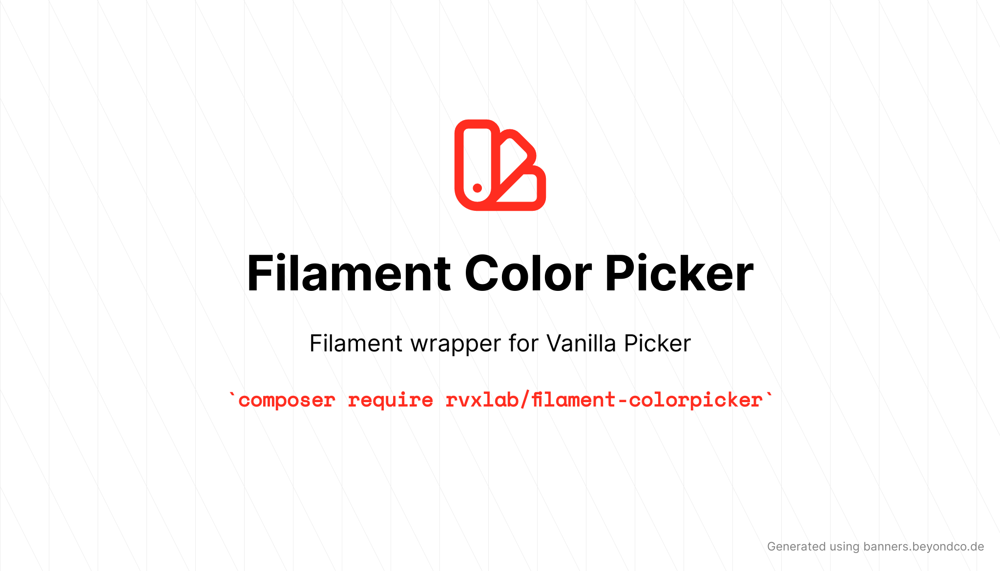

# Filament Color Picker



[](https://packagist.org/packages/rvxlab/filament-colorpicker)
[](https://github.com/rvxlab/filament-colorpicker/actions?query=workflow%3Arun-tests+branch%3Amain)
[](https://github.com/rvxlab/filament-colorpicker/actions?query=workflow%3A"Check+%26+fix+styling"+branch%3Amain)
[](https://packagist.org/packages/rvxlab/filament-colorpicker)

---

Filament Color Picker is a package for [Laravel Filament](https://github.com/laravel-filament/filament) that wraps [Vanilla Picker](https://github.com/Sphinxxxx/vanilla-picker) into a usable component.

## Installation

You can install the package via composer:

```bash
composer require rvxlab/filament-colorpicker
```

Optionally you can publish the views:

```bash
php artisan vendor:publish --tag=filament-colorpicker-views
```

## Usage

Reference `RVxLab\FilamentColorPicker\Forms\ColorPicker` in the `forms` method of a resource and you're good to go! 

```php
public static function form(Form $form): Form
{
    return $form
        ->schema([
            \RVxLab\FilamentColorPicker\Forms\ColorPicker::make('color'),
        ]);
}
```

All options below are analogous to the ones in the [Vanilla Picker documentation](https://vanilla-picker.js.org/gen/Picker.html#setOptions__anchor).

### Editor format

***Default:*** `EditorFormat::HEX()`

Set the editor format of the color picker.

```php
public static function form(Form $form): Form
{
    return $form
        ->schema([
            \RVxLab\FilamentColorPicker\Forms\ColorPicker::make('color')
                ->editorFormat(\RVxLab\FilamentColorPicker\Enum\EditorFormat::HSL()),
        ]);
}
```

You may also pass the string values of the `EditorFormat` enum.

### Popup placement

***Default:*** `PopupPosition::RIGHT()`

The popup placement can be set using `popupPosition`:

```php
public static function form(Form $form): Form
{
    return $form
        ->schema([
            \RVxLab\FilamentColorPicker\Forms\ColorPicker::make('color')
                ->popupPosition(\RVxLab\FilamentColorPicker\Enum\PopupPosition::BOTTOM()),
        ]);
}
```

You may also pass the string values of the `PopupPosition` enum.

You can also disable the popup entirely in which the popup just becomes part of the element itself:

```php
public static function form(Form $form): Form
{
    return $form
        ->schema([
            \RVxLab\FilamentColorPicker\Forms\ColorPicker::make('color')
                ->disablePopup(),
        ]);
}
```

### Alpha

***Default: true***

The alpha channel can be enabled or disabled by using `alpha`:

```php
public static function form(Form $form): Form
{
    return $form
        ->schema([
            \RVxLab\FilamentColorPicker\Forms\ColorPicker::make('color')
                ->alpha(false),
        ]);
}
```

An important thing to note is that the alpha setting also changes the validation.

Having the alpha channel enabled will validate the output as an 8-digit hex string, disabling will validate it as a 6-digit hex string.

### Preview

***Default: false***

The color preview can be enabled or disabled by using `preview`:

```php
public static function form(Form $form): Form
{
    return $form
        ->schema([
            \RVxLab\FilamentColorPicker\Forms\ColorPicker::make('color')
                ->preview(),
        ]);
}
```

### Layout

***Default: "default"***

The layout can be changed by using `layout`:

```php
public static function form(Form $form): Form
{
    return $form
        ->schema([
            \RVxLab\FilamentColorPicker\Forms\ColorPicker::make('color')
                ->layout('my-layout'),
        ]);
}
```

### Cancel button

***Default: false***

The cancel button can be enabled or disabled by using `cancelButton`:

```php
public static function form(Form $form): Form
{
    return $form
        ->schema([
            \RVxLab\FilamentColorPicker\Forms\ColorPicker::make('color')
                ->cancelButton(true),
        ]);
}
```

### Template

***Default: null***

The default template can be found in `views/vendor/filament-colorpicker/template.blade.php` after you publish the views.

To make changes, simply change this template and then pass a `View` object to the `template` method:

```php
public static function form(Form $form): Form
{
    return $form
        ->schema([
            \RVxLab\FilamentColorPicker\Forms\ColorPicker::make('color')
                ->template(view('filament-colorpicker::template')),
        ]);
}
```

You can also pass an HTML string directly, which then gets fed to the options as is.

### Debounce timeout

***Default: 500***

The debounce timeout in milliseconds, this option is only applicable when the popup has been disabled.

When the popup is enabled this option does nothing.

```php
public static function form(Form $form): Form
{
    return $form
        ->schema([
            \RVxLab\FilamentColorPicker\Forms\ColorPicker::make('color')
                ->debounceTimeout(1000),
        ]);
}
```

### Nullable

***Default: false***

To make the color picker nullable you can call the `nullable` method:

```php
public static function form(Form $form): Form
{
    return $form
        ->schema([
            \RVxLab\FilamentColorPicker\Forms\ColorPicker::make('color')
                ->nullable(),
        ]);
}
```

#### Known issue

Because Vanilla Picker does not handle null values properly the default initial value of a null-ed picker will be `#000000` or `#00000000` depending on the `alpha` setting.

This goes away when the picker is updated or the form is saved.

## Color swatch

To display a swatch on the table you can add the following column:

```php
public static function table(Table $table): Table
{
    return $table
        ->columns([
            \RVxLab\FilamentColorPicker\Columns\ColorSwatch::make('color'),
        ]);
}
```

### Copying

*Note: this makes use of the [clipboard API](https://developer.mozilla.org/en-US/docs/Web/API/Clipboard).*

You can call the `copyable` method on the column:

```php
public static function table(Table $table): Table
{
    return $table
        ->columns([
            \RVxLab\FilamentColorPicker\Columns\ColorSwatch::make('color')
                ->copyable(),
        ]);
}
```

When set, clicking on the swatch will cause the current color to be copied to the clipboard.

### Set the copy message

***Default: "Copied!"***

You can change the copy message by using the `copyMessage` method:

```php
public static function table(Table $table): Table
{
    return $table
        ->columns([
            \RVxLab\FilamentColorPicker\Columns\ColorSwatch::make('color')
                ->copyable()
                ->copyMessage('Color copied to clipboard!'),
        ]);
}
```

### Change the message timeout

***Default: 2000***

To change the length of time the message appears you can use the `copyMessageShowTimeMs` method:

```php
public static function table(Table $table): Table
{
    return $table
        ->columns([
            \RVxLab\FilamentColorPicker\Columns\ColorSwatch::make('color')
                ->copyable()
                ->copyMessageShowTimeMs(500),
        ]);
}
```

## Changelog

Please see [CHANGELOG](CHANGELOG.md) for more information on what has changed recently.

## Upgrading to 1.x

The only breaking change is that this package now relies on `filament/filament:^2.0`, other than that there are no breaking changes.

If you published the JavaScript file in the past you can delete it, the file is now loaded through Filament directly

## Contributing

For development this repository contains a Docker Compose file to provide all the tools needed, as well as a Makefile to run useful commands.

To make use of this, ensure you have Docker and Docker Compose installed.

To get started:

```bash
make dcbuild # Build the Docker image
make start # Run the container
make composer cmd=install
```

Additionally you can copy and modify `docker-compose.override.yml.dist` to add any additional changes needed for the workspace container.

Please see [CONTRIBUTING](.github/CONTRIBUTING.md) for details.

## Credits

- [RVxLab](https://github.com/RVxLab)
- [All Contributors](../../contributors)

## License

The MIT License (MIT). Please see [License File](LICENSE.md) for more information.
